# Project backgroud


The goal is setting up a CI/CD pipeline for deploying a Dockerized version of the 2048 game to AWS. The pipeline automates the process of building, testing, and deploying the game to a scalable infrastructure using Amazon ECS, Amazon ECR, and AWS CodePipeline.

Services Learnt in the project:

* AWS CodePipeline: Orchestrates the CI/CD pipeline, automating the build, test, and deployment stages. 
* Amazon ECS: Deploys and manages containerized applications using Fargate for serverless container management. 
* Amazon ECR: Stores and manages Docker images used in the ECS tasks. 
* AWS CodeBuild: Handles the build phase of the pipeline, including Docker image creation.
* IAM Roles & Policies: Ensure secure access between the services involved. 

### Diagram
the architectural diagram for the project:

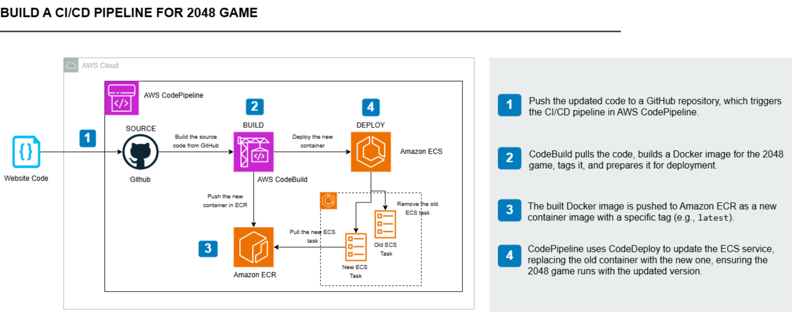

### Steps

1. Set Up ECS Cluster and ECR Repository
2. Prepare the 2048 Game Code
3. Set Up CodeBuild for Continuous Integration
4. Set Up CodePipeline for Continuous Deployment
5. Test the automation pipeline


# Setp1 Set Up ECS Cluster and ECR Repository

### Run a Docker container and push to ECR

check the Dockerfile:

```vim 
# Use the official Nginx image as the base
FROM nginx:latest

# Copy the 2048 game files to the Nginx web root
COPY . /usr/share/nginx/html

# Expose the default Nginx HTTP port
EXPOSE 80

# Start Nginx when the container starts
CMD ["nginx", "-g", "daemon off;"]
```
Build the Docker Image

```vim
docker build -t 2048-game .
```

create ECR on AWS console:

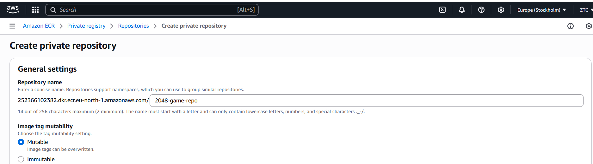

tag and push the image to ECR

```vim
docker tag 2048-game:latest <ECR_URI>:latest

aws ecr get-login-password --region ap-south-1 | docker login --username AWS --password-stdin <ECR_URI>

docker push <ECR_URI>:latest
```

verify the image in ECR

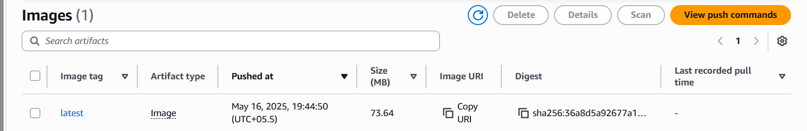

### Create ECS cluster to run the website

Create the ECS Service‑Linked Role

1. In the AWS Console, go to IAM → Roles → Create role.
2. Under Select trusted entity, choose AWS service.
3. In Use case, select Elastic Container Service.

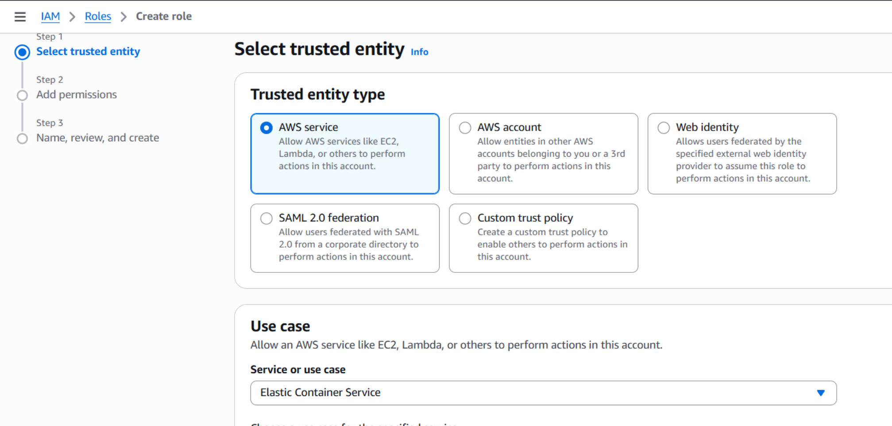

Register a Task Definition

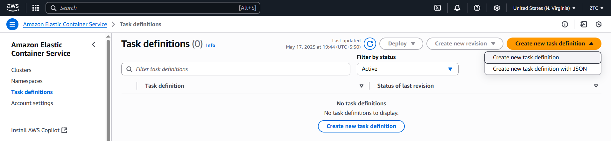

Under Container definitions, click Add container:
- Container name: `XXXXX`
- Image: `<your‑ecr‑uri>:latest`

Create a Service

- In ECS → Clusters, select `2048-game-cluster`.
- Services tab → Create.

Security group should allow HTTP (port 80)

View service:
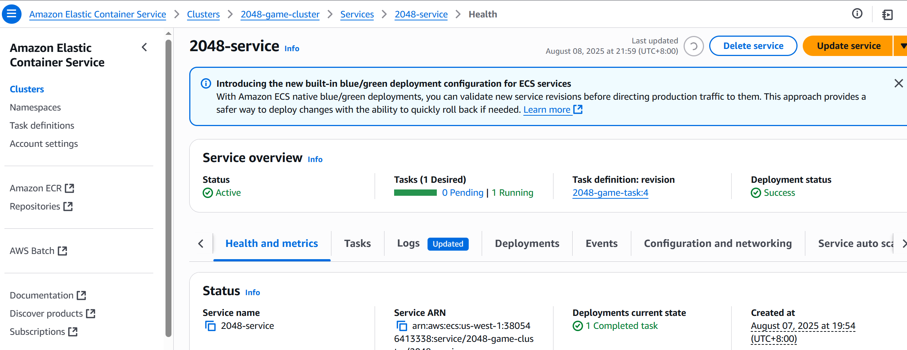


### Access the website with Public IP of the ECS Task

http://<Public-IP>:80

Verify Functionality

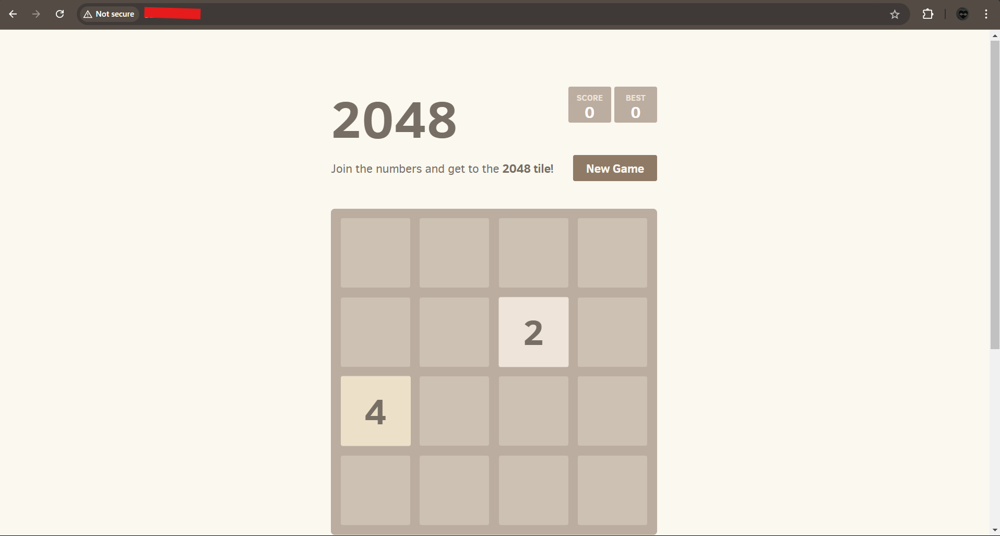


# Setp2 Prepare Website Code with Github

### Create Your Own GitHub Repository

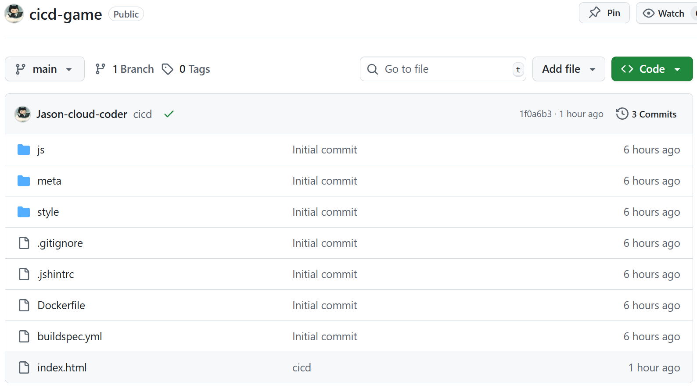

Create buildspec.yml

- The `buildspec.yml` file is crucial for AWS CodeBuild as it defines the build commands. You’ll need to modify it to reflect your project’s ECR URI and ECS service details.
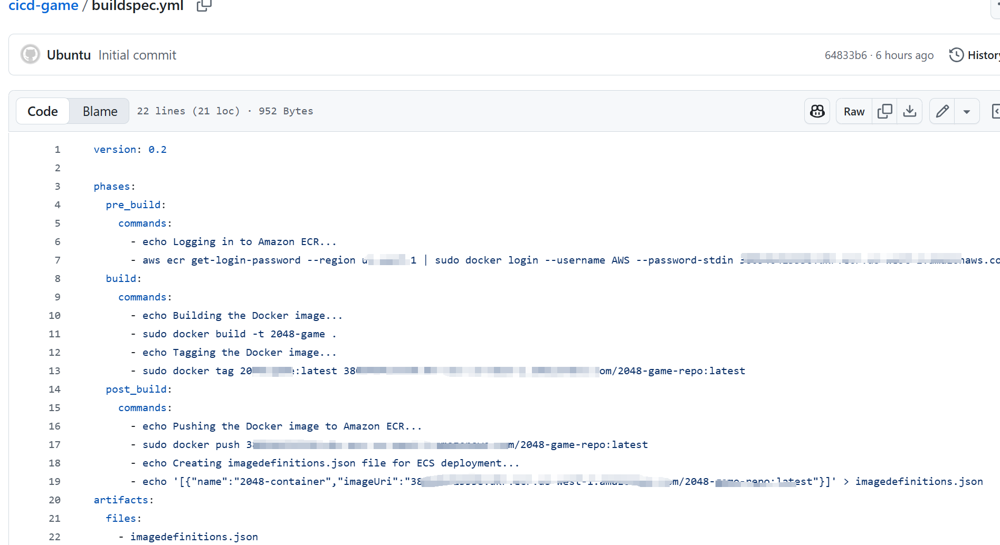


Push Your Local Code to GitHub(Commands)

```vim
git init
git add .
git commit -m "Initial commit"
git remote remove origin
git remote add origin <your-repository-url>
git branch -M main
git push -u origin main
```

# Setp3 Set Up CodeBuild for Continuous Integration

1. Create an IAM Role for CodeBuild.
2. Create a S3 Bucket for Build Artifacts.
3. Create a CodeBuild Project.
4. Test the CodeBuild Project.


### 3.1 Create a New IAM Role
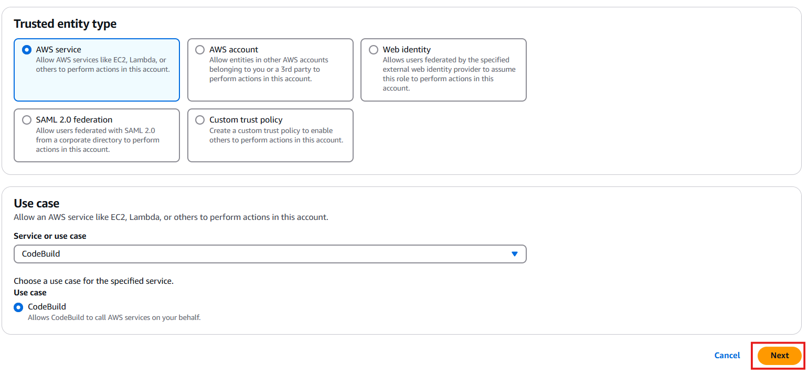

- Attach the following Managed Policies:

AmazonEC2ContainerRegistryFullAccess:

AWSCodeBuildDeveloperAccess: 

AmazonS3FullAccess:

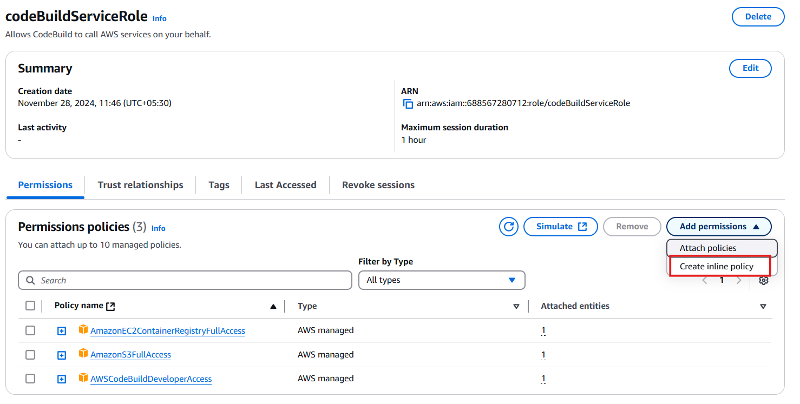

Attach the following Inline Policy to allow CodeBuild to update ECS services:

```vim
{
    "Version": "2012-10-17",
    "Statement": [
        {
            "Effect": "Allow",
            "Action": [
                "ecs:UpdateService",
                "ecs:DescribeServices"
            ],
            "Resource": "<ENTER_YOUR_ECS_SERVICE_ARN>"
        }
    ]
}
```

### 3.2 Create an S3 Bucket for Build Artifacts

CodeBuild generates output files, such as Docker images and logs. We store them in Amazon S3 so they can be accessed later

### 3.3 Create a CodeBuild Project

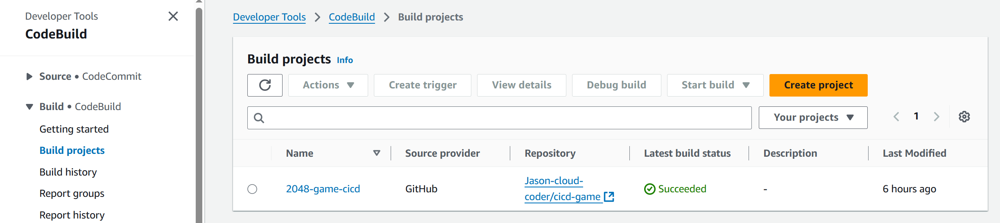

- Source Provider: Choose GitHub (or other source if required) and connect to your GitHub repository. Connect to GitHub by clicking on Manage default source credential. 

- Choose the option OAuth App for Credential type and CodeBuild for service. 
  
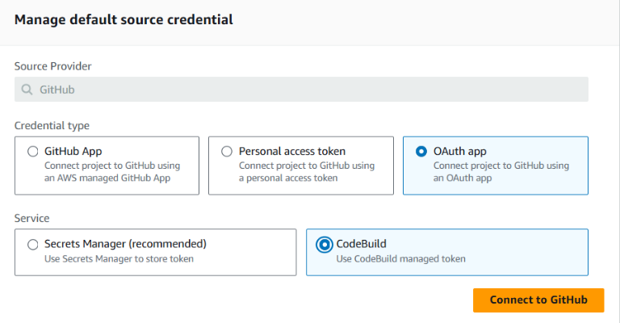

- Buildspec Configuration

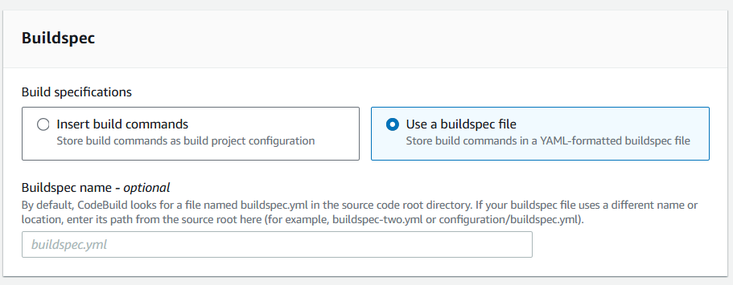

### 3.4 Test the CodeBuild Project

Start a Build
Trigger the build manually from the CodeBuild console and monitor its progress.

Verify Build Success:

Verify the imagedefinitions.json file is created in the specified S3 artifact bucket.

# Setp4 Set Up CodePipeline for Continuous Deployment

AWS CodePipeline is the service that connects all the different stages of your CI/CD pipeline. First, we need to create a new pipeline to define how changes in your code will trigger builds and deployments

Create a New Pipeline

Add Source Stage (GitHub)
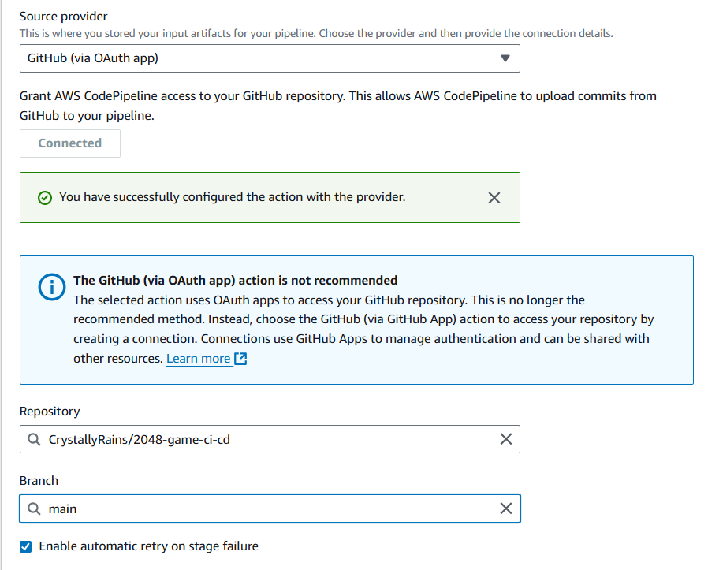

Add Build Stage (CodeBuild)

 Add Deploy Stage (ECS Deployment)

 The established codepipeline

 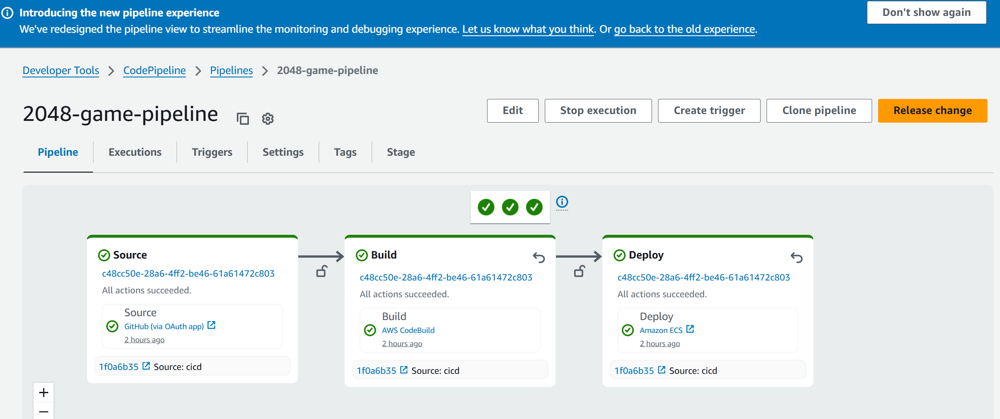


# Setp5 Test the automation pipeline

Modify the _index.html_

      <h1 class="title">2048 game 2rd</h1>

commit the code to github

The modification will trigger the codepipeline to generate new container deployment

the automatic process of code-pipeline
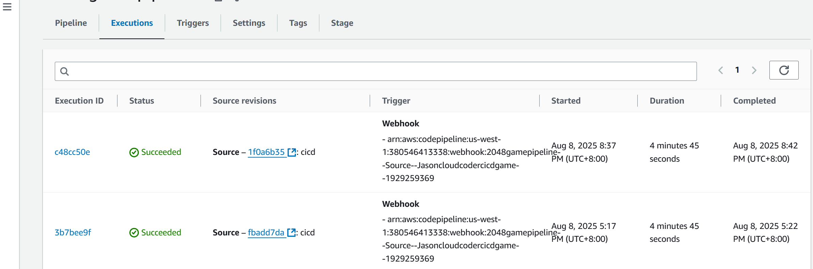

Re-access the webpage, the page will show the modification.

 


# Conclusion

This project focused on building a complete CI/CD pipeline on AWS to automate the deployment of a containerized application, enhancing efficiency, reliability, and scalability.
